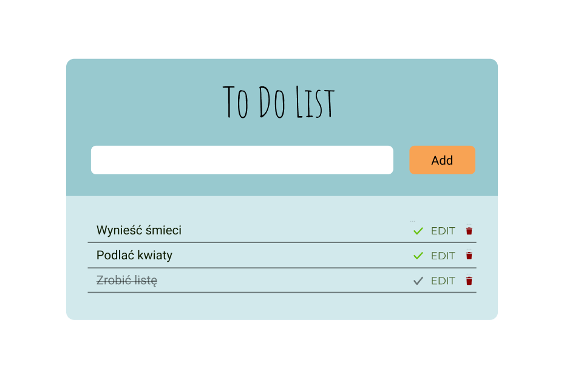
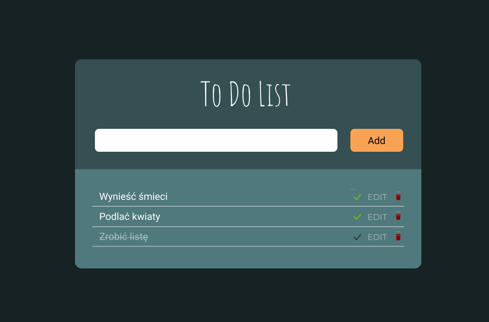
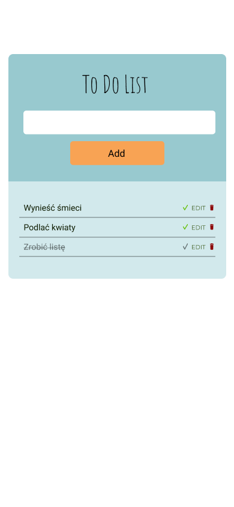

# To Do App

## Design

W html aplikacja jest podzielona na trzy sekcje:

1. Sekcja o klasie "todo-header", zawierająca:

- `<h1>`To Do List`</h1>`
- input do wpisywania treści nowego zadania
- pusty paragraf do wyświetlenia error
- `<button>`Add`</button>`

2. Sekcja o klasie "todo-list" z zadaniami w formie `<ul>` listy. Każde zadanie jest osobnym elementem listy `<li>`, w którym znajduje się treść zadania, oraz 3 przyciski `<button>` do sterowania zadaniem:

- check mark (V)
- klikalny napis "EDIT"
- symbol kosza

3. Div z klasą "popup" do obługi edycji zadań.

## Sposób działania

1. W momencie załadowania strony wywoływana z localStorage pobierana jest lista zadań `"tasks"` oraz wywoływana jest funkcja drukująca zadania z pobranej listy `printTodoList()`. W przypadku braku `"tasks"` w localStorage, tworzona jest nowa tablica.
2. Wprowadzanie i dodawanie nowych zadań odbywa się za pomocą `<input>` oraz <button>Add</button>.

- Przed dodaniem nowego zadania sprawdzany jest warunek czy task nie jest pusty
- Tworzony jest nowy obiekt o unikalnym id i `task: treść zadania`
- Obiekt z zadaniem dodawany jest do tablicy zadań i wypychany na localStorage
- Do HTML dodawany jest nowy, zbudowany w JavaScript element `<li>` zawierający nowe zadanie

3. Do obsługi zadań (tasków) nasłuchujemy na akcję 'click' na całej liście `<ul>`. Obsługiwany jest `event.target` kliknięcia.
4. Po kliknięciu ikonę <button>V</button> treść zadania zostaje przekreślona
5. Edycja tekstu zadania odbywa się poprzez kliknięcie napisu `EDIT` przy wybranym zadaniu.

- Wywołuje to diva nad To Do listą (`popup`)
- W popupie można edytować treść zadania, zaakceptować wprowadzoną zmianę <button>Accept</button> lub odrzucić zmiany <button>Cancel</button>
- Po zaakceptowaniu wprowadzonej zmiany tablica z zadaniami jest uaktualniana przy pomocy metody forEach() i wrzucana do localStorage

6. Zadanie usuwa się poprzez naciśnięcie przycisku z symbolem kosza.

- Z tabliy z zadaniami usuwane jest zadanie o odpowiednim id przy urzyciu metody filter()
- `<li>` z zadaniem jest usuwane przy pomocy remove()
